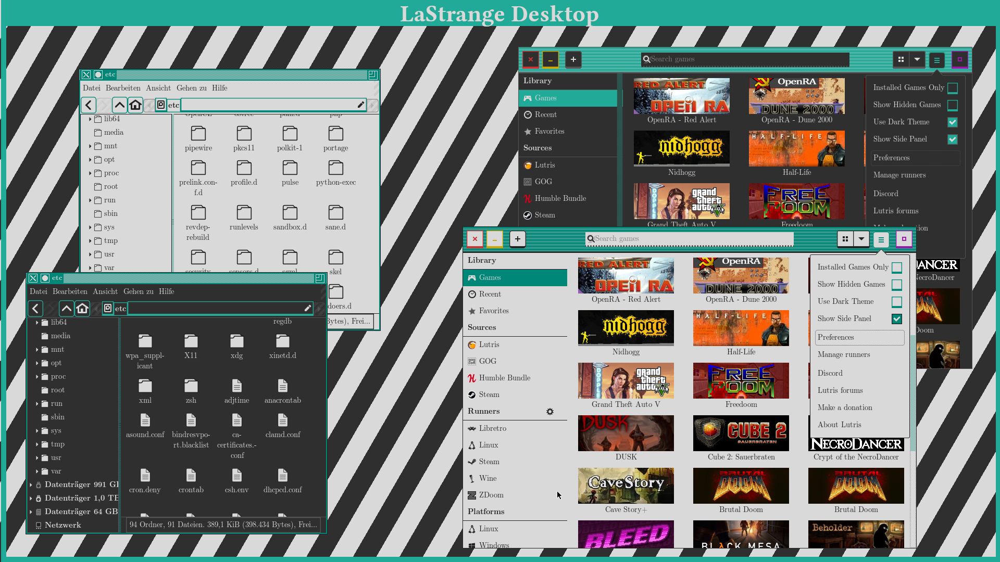

# LaStrange Desktop

A clean, simple desktop theme for easy and focused computing.
Originally developed for [dogfooding](https://en.wikipedia.org/wiki/Eating_your_own_dog_food), the theme aims to be simple in both design and implementation while keeping a distinctly Unix-like aesthetic ...with some modern quality-of-life considerations.

The name is a reference to Tom LaStrange, the inventor of [the TWM window manager](https://en.wikipedia.org/wiki/Twm), which served as the main inspiration for the desktop theme. Other influences include printed paper, [the Athena widget library](https://en.wikipedia.org/wiki/X_Athena_Widgets) and [the Amiga Workbench](https://en.wikipedia.org/wiki/Workbench_(AmigaOS))

# Installation

## Gentoo

Simply install the package `x11-themes/lastrange-gtk-theme` from [my custom overlay repository.](https://github.com/zibonbadi/gentoo-overlay)

## Fedora/RPM-based distributions

Thanks to [@darkshram](https://github.com/darkshram) you can find an RPM Spec file in `contrib`. [Create a package from that.](https://docs.fedoraproject.org/en-US/Fedora_Draft_Documentation/0.1/html/RPM_Guide/ch08s02.html)

## Other Distributions

Simply drag the `LaStrange*``directories into your themes directory. I recommend using `$HOME/.local/share/themes`, however if you want to install the theme system-wide, you may also put it in `/usr/share/themes`.

# Philosophy

## Do One Thing And Do It Well

This theme being tailor-made for Linux (notably the XFCE desktop environment), it's design is naturally influenced by the Unix philosophy.
Everything is designed according to a set of simple, predefined rules (outlined below), which are to be applied thoroughly, consistently and if possible automatically across the entire system, such that the user's cognitive load is reduced by associative consistency. In short: Things that work similar, look similar, are similar.

## No Frills, No Distractions, No Secrets

Most modern UI designs attempt to simplify the user experience by hiding or obfuscating less important features. Especially in flat designs this tends to lead to confusion about what is interactible, in which way and how the UI is organized.

Beyond that many modern UI designs also employ so called "calls to action". In practice, this usually means that elements the designer deems important are emphasized by making them attention-grabbing, which can be distracting as well as allow for [dark patterns](https://en.wikipedia.org/wiki/Dark_pattern).

LaStrange does not impose any particular order of importance to an action. Instead, everything is distilled to it's essential function and presented equally relying instead on visual variables and Gestalt to convey information about the UI. This leads to a clean, consistent and uncluttered experience for users who know what they want their system to do.

## Let The Computer Do The Work

Wherever possible, everything is rendered on-the-fly, **without** the use of any pre-built assets (due to restrictions this currently only applies to the GTK theme). This reduces labour effort, keeps consistency and is better scalable to increasing display resolutions/pixel densities. In case of [the LaStrange icon theme](https://github.com/zibonbadi/lastrange-icons/), this means that *everything* will be built upon vector graphics only.

## You Are Not Alone

Every design exists within a context. Thus, it is not enough for a UI-design to be internally consistent; it has to conform to the UI/UX guidelines of it's context as well to ensure a pleasant, consistent user experience.
For example, [the LaStrange icon theme](https://github.com/zibonbadi/lastrange-icons/) is designed to work within both light and dark modes based on the same set of icons.

# Practice

## Color palette

The aim of of LaStrange lies in simplifying UI visuals by reducing attention-grabbing colors down to a minimum. Thus color is to be used sparingly, with a main highlight color being used to indicate interactivity.
The main shades of light and dark grey have also intentionally been chosen to reduce eye strain due to high contrast on bright displays.

### Primary colors

Although LaStrange is built in such a way that it allows for easy creation of custom color pallettes (a fact which is further highlighted by the included theme set *Default, Dark, Solarized Light, Solarized Dark & Industrial*), the overall design is based on the 3 primary colors listed below:

| Color | dark | light |
|--|--|--|
| Black | |	#1f1f1f	|
| White | |	#d9d9d9	|
| Cyan	|	#19a698 |	#22AA99 (#47ccbf for use in 16 color mode)	|

### Secondary Palette (for 16 colors)

| Color | dark | light |
|--|--|--|
| Red |	#cc3333 |	#ff7373
| Green |	#179917 |	#00de00
| Yellow |	#a6954b |	#cca700
| Blue |	#175ce6 |	#8797ff
| Magenta |	#9a19a6 |	#f066ff

